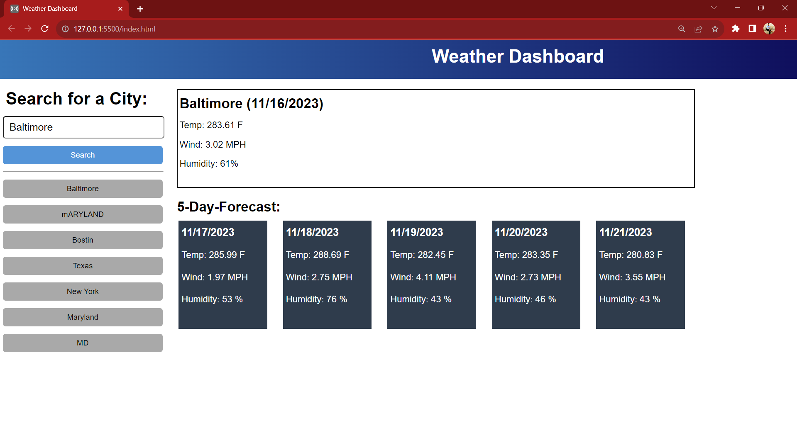

# Weather Dashboard

## Description
Step into my Weather Dashboard project, where the forecast is at your fingertips! Utilizing a dynamic weather API, this dashboard not only provides real-time updates for the current weather but also allows you to explore forecasts for specific areas. Simply search for the location you're interested in, and uncover both immediate conditions and a detailed 5-day outlook. It's your go-to hub for personalized and comprehensive weather information, combining user-friendly design with functionality for a seamless experience. Stay informed and plan ahead with the Weather Dashboard!

## How it works
Real-Time Updates: The dashboard utilizes a dynamic weather API to provide immediate and accurate updates on the current weather conditions.
Location-Specific Forecast: Simply enter the location you're interested in, and the dashboard fetches a detailed 5-day forecast tailored to that area.
User-Friendly Search: The search functionality allows you to effortlessly find weather information for specific areas of interest.
Comprehensive Information: Get a snapshot of the immediate weather and delve into a detailed 5-day outlook, ensuring you have all the information you need at your fingertips.

### Technologies Used
- HTML
- CSS
- JavaScript

### Apis
- Weather Api
- Nominatim Api

Deployed Site: https://batking74.github.io/Weather-Dashboard/

GitHub Repo: https://github.com/Batking74/Weather-Dashboard
